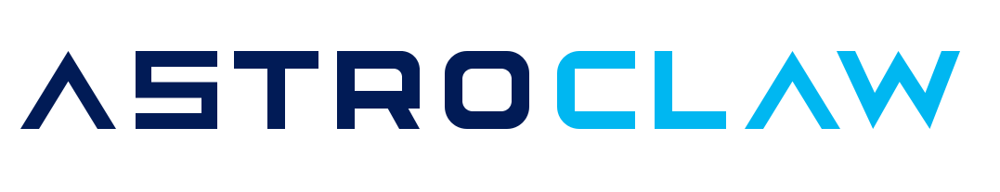

<p align="center">
  <picture>
    <source media="(prefers-color-scheme: dark)" srcset="docs/brand/logo-dark.svg">
    
  </picture>
</p>
<p align="center">
  <picture>
    <source media="(prefers-color-scheme: dark)" srcset="docs/brand/wordmark-dark.svg">
    
  </picture>
</p>

> A NASA Power of Ten compliant fork of [openclaw](https://github.com/openclaw/openclaw) — a personal AI assistant you run on your own devices.

<p align="center">
  <a href="LICENSE"></a>
  <a href="https://github.com/openclaw/openclaw"></a>
  <a href="#derivation"></a>
  <a href="#install"></a>
</p>

## What this repo is

**astroclaw** is the upstream [openclaw](https://github.com/openclaw/openclaw) codebase re-rendered file-by-file through a continuous **NASA Power of Ten** compliance pipeline. Runtime behavior, feature set, and CLI surface are identical to openclaw — the distinction is **code quality, auditability, and patch-friendliness**, not capability.

Every commit on `main` has passed:

- ✅ NASA P10 static scan (bounded loops, explicit control flow, narrow scope, checked return values, no dynamic dispatch on hot paths)
- ✅ Upstream test suite (TypeScript build, vitest, integration)
- ✅ Promotion from a `p10-pending` staging branch through a gated `bless` step

The result is a codebase that is easier to audit, easier to extend, and easier to patch against than the upstream — at zero runtime cost.

## Why P10?

NASA's [Power of Ten Rules](https://en.wikipedia.org/wiki/The_Power_of_10:_Rules_for_Developing_Safety-Critical_Code) were designed for safety-critical software (Mars rovers, flight control). Applied to a personal-AI-assistant codebase, they yield:

- **Predictability** — bounded iteration limits worst-case execution time per call
- **Auditability** — narrow variable scope and checked returns surface bugs at the source
- **Patchability** — explicit control flow makes diffs small and reviewable
- **Reduced attack surface** — no `eval`, no implicit dynamic loading on hot paths

The original codebase is feature-rich and pragmatic; the P10 processing pass is opinionated about reliability without changing what the software does.

## What it does

Personal, single-user AI assistant that answers on the channels you already use.

**Supported channels**: WhatsApp · Telegram · Slack · Discord · Signal · iMessage · Google Chat · IRC · Microsoft Teams · Matrix · Feishu · LINE · Mattermost · Nextcloud Talk · Nostr · Synology Chat · Tlon · Twitch · Zalo · WeChat · QQ · WebChat

**Capabilities**:

|                              |                                                                |
| ---------------------------- | -------------------------------------------------------------- |
| 🎙️ **Voice**                 | Wake words + talk mode on macOS, iOS, and Android              |
| 🎨 **Canvas**                | Agent-driven live visual workspace with A2UI                   |
| 🔀 **Multi-channel routing** | Assign channels and accounts to isolated agent sessions        |
| 🛠️ **First-class tools**     | Browser, canvas, cron, sessions, Discord/Slack actions         |
| 📦 **Skills**                | Bundled + workspace + registry ([ClawHub](https://clawhub.ai)) |
| 📱 **Companion apps**        | macOS menu bar, iOS and Android nodes                          |

## Install

**Runtime**: Node 24 (recommended) or Node 22.16+

```bash
npm install -g astroclaw@latest
# or
pnpm add -g astroclaw@latest

astroclaw onboard --install-daemon
```

The npm package name and CLI command are `astroclaw`. The runtime is wire-compatible with openclaw — same configuration files, same skills, same channel adapters.

## Quick start

```bash
astroclaw gateway --port 18789 --verbose

# Send to any paired channel
astroclaw agent --message "What's on my calendar?"
```

Full setup walkthrough: [Getting started](https://docs.openclaw.ai/start/getting-started)

After upgrades, run `astroclaw doctor`. See the [Updating guide](https://docs.openclaw.ai/install/updating).

## Security defaults

Default DM policy (`dmPolicy="pairing"`): unknown senders receive a pairing code; no message is processed until approved.

```bash
astroclaw pairing approve <channel> <code>
```

For group / multi-user deployments, set `agents.defaults.sandbox.mode: "non-main"` to run non-primary sessions in sandboxes. Full guide: [Security](https://docs.openclaw.ai/gateway/security) · [Sandboxing](https://docs.openclaw.ai/gateway/sandboxing)

## Docs

The upstream openclaw docs apply directly — runtime behavior is identical.

| Topic           | Link                                                                                     |
| --------------- | ---------------------------------------------------------------------------------------- |
| Getting started | [docs.openclaw.ai/start/getting-started](https://docs.openclaw.ai/start/getting-started) |
| Channels        | [docs.openclaw.ai/channels](https://docs.openclaw.ai/channels)                           |
| Configuration   | [docs.openclaw.ai/gateway/configuration](https://docs.openclaw.ai/gateway/configuration) |
| Security        | [docs.openclaw.ai/gateway/security](https://docs.openclaw.ai/gateway/security)           |
| Tools & Skills  | [docs.openclaw.ai/tools](https://docs.openclaw.ai/tools)                                 |
| Docker          | [docs.openclaw.ai/install/docker](https://docs.openclaw.ai/install/docker)               |
| Architecture    | [docs.openclaw.ai/concepts/architecture](https://docs.openclaw.ai/concepts/architecture) |

## Derivation

```
github.com/openclaw/openclaw  (upstream, MIT)
        │
        │  continuous nasa-code-agent pipeline:
        │  plan → build → P10-scan → tests → audit
        │
        ▼
github.com/P1R4N351/astroclaw  (this repo)
        │
        ├── main          ← blessed → published here
        └── p10-pending   ← worker stages commits → blessed into main
```

Commits enter `p10-pending` one file at a time. Each rewrite must produce a scan-green tree and a tests-green build before the worker commits it. Periodic `bless` runs fast-forward `main` from `p10-pending`, then push to the public mirror.

**P10 processing targets**:

- Explicit control flow (no `eval`, no dynamic `require` on hot paths)
- Bounded iteration on performance-sensitive loops
- Minimal preprocessor surface
- Narrowed variable scope
- Checked return values on non-void calls
- No floats in safety-relevant arithmetic
- Liberal assertions at function boundaries
- Compiler warnings as errors

## Contributing

**Upstream feature contributions** — new channels, new tools, runtime behavior changes — belong at [openclaw/openclaw](https://github.com/openclaw/openclaw). This repo automatically inherits those via the conversion pipeline.

**This repo's lane** — P10 compliance issues, scan findings, audit artifacts, patch-friendliness improvements. Open an issue here if:

- You found a P10 violation in `main` (false-negative in the scan)
- A function's P10 rewrite changed observable behavior (regression)
- An audit pattern is missing from the scan ruleset

See [CONTRIBUTING.md](CONTRIBUTING.md) for the issue template and triage flow.

## License

MIT — see [LICENSE](LICENSE).

Inherits the MIT license from upstream openclaw. All third-party code, model weights, and integrations retain their original licenses; see source headers for specifics.
